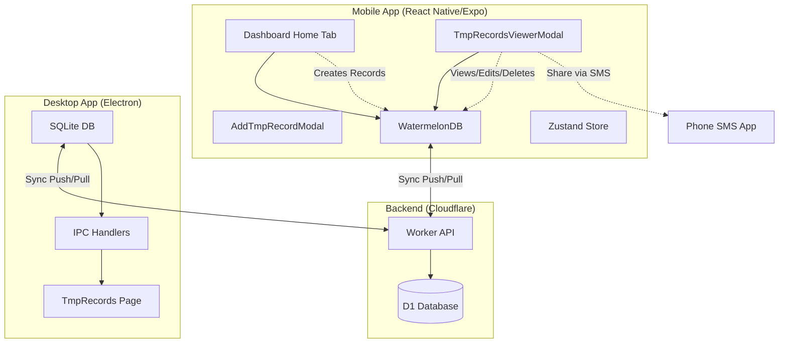
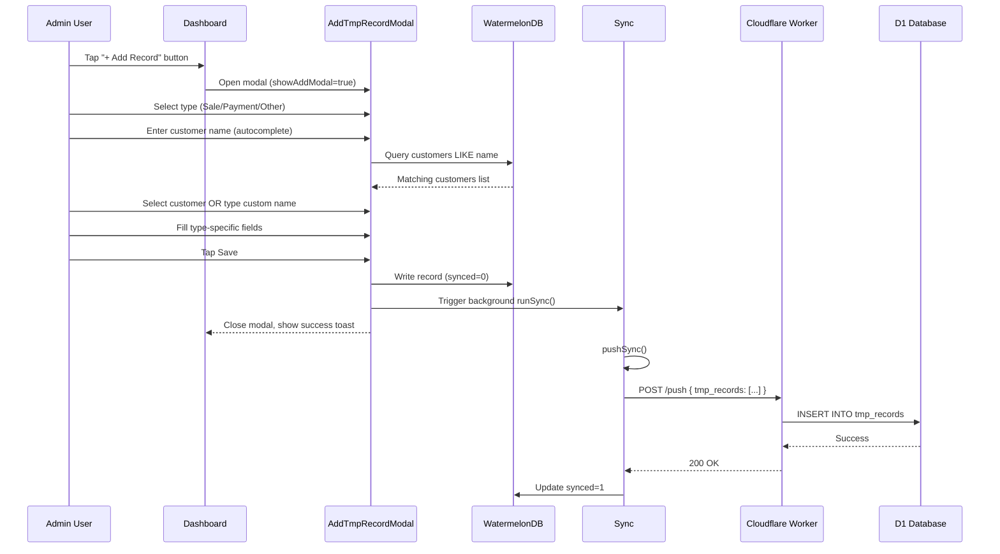
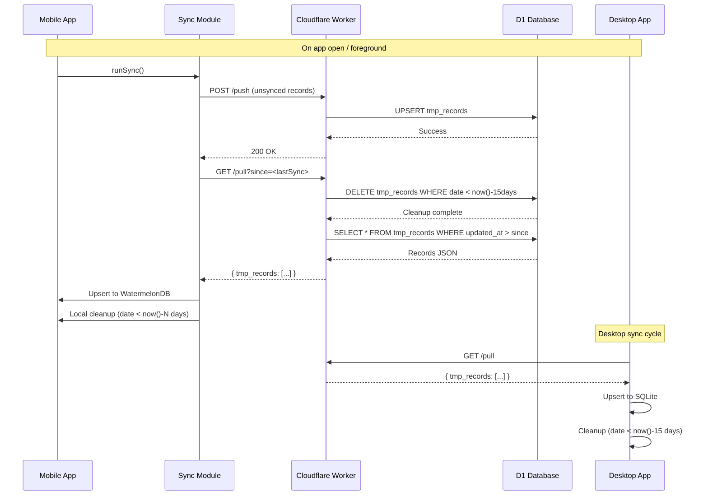
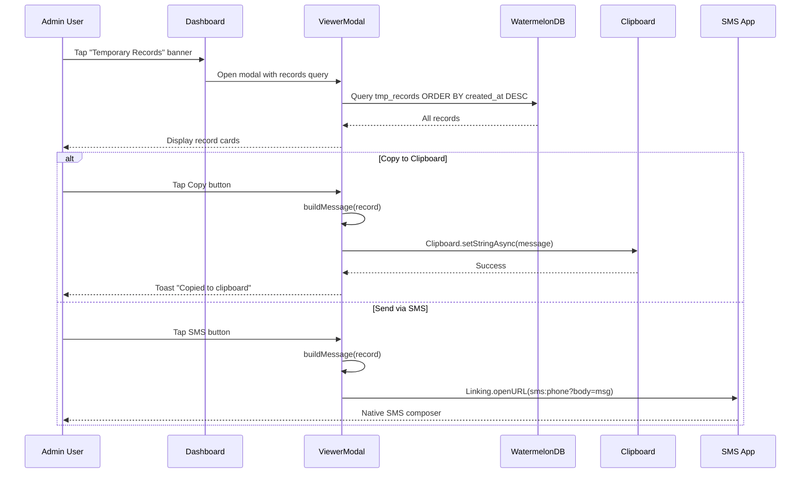

# Design Document: Temporary Records (tmp-records)

## Overview

Temporary Records is a lightweight, quick-entry record system for the admin to log sales, payments, and other expenses on the go — without going through the full formal sale/payment flows. These records are temporary by design and auto-deleted after a configurable retention period. They are purely informational — they do not affect customer balances, product stock, or any other business state.

The feature spans three codebases: the admin mobile app (React Native/Expo), the desktop app (Electron), and the Cloudflare Worker backend (D1 database). Mobile has full CRUD capabilities, while desktop provides a read-only table view.

## Architecture



### Key Design Decisions

| Decision | Rationale |
|----------|-----------|
| Single `tmp_records` table with type discriminator | Simplifies sync logic, cleanup queries, and UI filtering. One table instead of three. |
| Customer autocomplete with denormalized storage | Customer name and phone stored directly on record — no JOINs needed, records remain valid if customer is deleted. |
| No balance/stock impact | Purely informational records for quick logging, separate from formal sales/payments. |
| Configurable local retention (1-30 days) | Admin controls how long records stay on mobile device. |
| Hard-coded cloud retention (15 days) | Simple, predictable cleanup on D1 without configuration. |
| Mobile: write access, Desktop: read-only | Mobile-first for quick entry; desktop for historical viewing. |

## Sequence Diagrams

### Create Temporary Record Flow (Mobile)



### Sync and Cleanup Flow



### View and Share Flow (Mobile)



## Components and Interfaces

### Mobile App Components

#### Component 1: AddTmpRecordModal

**Purpose**: Modal for creating and editing temporary records with type-specific forms and customer autocomplete.

**Interface**:
```typescript
interface AddTmpRecordModalProps {
  visible: boolean;
  onClose: () => void;
  editRecord?: TmpRecord | null;
}
```

**State**:
```typescript
type RecordType = 'sale' | 'payment' | 'other';

interface FormState {
  type: RecordType;
  customerId: string | null;
  customerName: string;
  customerPhone: string | null;
  qty: number | null;
  weight: number | null;
  discount: number | null;
  totalValue: number | null;
  amount: number | null;
  reason: string;
}
```

**Responsibilities**:
- Display type selector pills (Sale / Payment / Other)
- Show/hide fields based on selected type
- Provide customer autocomplete from WatermelonDB customers table
- Auto-calculate rate from weight and total value
- Validate required fields before save
- Create or update record in WatermelonDB
- Trigger background sync after save

#### Component 2: TmpRecordsViewerModal

**Purpose**: Modal for viewing, filtering, and managing existing temporary records with share actions.

**Interface**:
```typescript
interface TmpRecordsViewerModalProps {
  visible: boolean;
  onClose: () => void;
  records: TmpRecord[];
}
```

**Responsibilities**:
- Display filter pills (All / Sale / Payment / Other)
- Render record cards with type-specific formatting
- Provide delete action with confirmation dialog
- Open AddTmpRecordModal in edit mode
- Copy formatted message to clipboard
- Open native SMS app with pre-filled message
- Display empty state when no records exist

#### Component 3: Dashboard Home Tab (index.tsx modifications)

**Purpose**: Add entry points for temporary records feature.

**New UI Elements**:
- "+ Add Record" button — large rectangular button opening AddTmpRecordModal
- "Temporary Records" banner — shows record count, opens TmpRecordsViewerModal

**State Additions**:
```typescript
const [showAddModal, setShowAddModal] = useState(false);
const [showViewerModal, setShowViewerModal] = useState(false);

const tmpRecords = useQuery(
  database.collections.get<TmpRecord>('tmp_records')
    .query(Q.sortBy('created_at', Q.desc))
);
```

### Desktop App Components

#### Component 4: TmpRecords Page

**Purpose**: Read-only table view of synced temporary records with filtering.

**Interface**:
```typescript
interface TmpRecordsPageProps {}

interface FilterState {
  type: 'all' | 'sale' | 'payment' | 'other';
  dateFrom: string | null;
  dateTo: string | null;
}

interface PageState {
  records: TmpRecord[];
  totalCount: number;
  page: number;
  pageSize: number;
}
```

**Responsibilities**:
- Fetch records via IPC (`tmp-records:list`, `tmp-records:count`)
- Display table with type, customer/reason, phone, amounts, date columns
- Provide type dropdown filter
- Provide date range filter
- Implement pagination
- Format monetary values (paise to rupees)

## Data Models

### TmpRecord Model

```typescript
interface TmpRecord {
  id: string;                    // UUID generated client-side
  type: 'sale' | 'payment' | 'other';
  customer_id: string | null;    // Optional FK to customers.id
  customer_name: string | null;  // Denormalized for display
  customer_phone: string | null; // Denormalized for SMS pre-fill
  qty: number | null;            // Sale: quantity of goods
  weight: number | null;         // Sale: weight in kg
  rate: number | null;           // Sale: auto-calculated (total_value / weight)
  discount: number;              // Sale/Payment: discount in paise
  total_value: number | null;    // Sale/Payment: total in paise
  amount: number | null;         // Other: amount in paise
  reason: string | null;         // Other: free-text reason
  date: string;                  // YYYY-MM-DD (user-assigned date)
  created_at: string;            // ISO 8601 (auto-set on creation)
  updated_at: string;            // ISO 8601 (auto-set on update)
  synced: number;                // 0 = unsynced, 1 = synced
}
```

**Validation Rules**:
- `type` must be one of: 'sale', 'payment', 'other'
- For 'sale' and 'payment': `customer_name` must be non-empty
- For 'other': `amount` must be > 0
- `date` must be valid YYYY-MM-DD format
- All monetary values stored in paise (integer)
- `rate` is computed: `total_value / weight` (if both present)

### Field Visibility by Type

| Field | Sale | Payment | Other |
|-------|------|---------|-------|
| customer_name (autocomplete) | ✅ Show | ✅ Show | ❌ Hide |
| qty | ✅ Show | ❌ Hide | ❌ Hide |
| weight | ✅ Show | ❌ Hide | ❌ Hide |
| rate (auto-calculated) | ✅ Show | ❌ Hide | ❌ Hide |
| discount | ✅ Show | ✅ Show | ❌ Hide |
| total_value | ✅ Show | ✅ Show | ❌ Hide |
| amount | ❌ Hide | ❌ Hide | ✅ Show |
| reason | ❌ Hide | ❌ Hide | ✅ Show |

## Algorithmic Pseudocode

### Algorithm: Customer Autocomplete Search

```pascal
ALGORITHM searchCustomers(input)
INPUT: input of type String (user's search query)
OUTPUT: results of type Array<Customer>

PRECONDITION: input is a non-empty string
POSTCONDITION: Returns up to 5 matching customers sorted by name

BEGIN
  // Sanitize input for LIKE query
  sanitized ← escapeLikeWildcards(input)
  
  // Query WatermelonDB customers table
  results ← database.collections.get('customers')
    .query(
      Q.where('name', Q.like(`%${sanitized}%`)),
      Q.sortBy('name', Q.asc),
      Q.limit(5)
    )
    .fetch()
  
  RETURN results
END
```

**Preconditions**:
- `input` is a non-null string
- Customers table exists and is accessible

**Postconditions**:
- Returns array of Customer objects (max 5)
- Each customer's name contains the search input (case-insensitive)
- Results sorted alphabetically by name

### Algorithm: Save Temporary Record

```pascal
ALGORITHM saveTmpRecord(formData, editRecord)
INPUT: formData of type FormState, editRecord of type TmpRecord | null
OUTPUT: void

PRECONDITION: Form has passed validation
POSTCONDITION: Record is persisted to WatermelonDB with synced=0

BEGIN
  // Validate type-specific requirements
  IF formData.type IN ['sale', 'payment'] THEN
    ASSERT formData.customerName IS NOT EMPTY
  END IF
  
  IF formData.type = 'other' THEN
    ASSERT formData.amount > 0
  END IF
  
  // Convert rupees to paise
  discountPaise ← round((formData.discount OR 0) * 100)
  totalValuePaise ← round((formData.totalValue OR 0) * 100)
  amountPaise ← round((formData.amount OR 0) * 100)
  
  // Compute rate for sale records
  IF formData.weight > 0 AND totalValuePaise > 0 THEN
    computedRate ← totalValuePaise / formData.weight
  ELSE
    computedRate ← null
  END IF
  
  now ← currentISO8601Timestamp()
  dateStr ← now.slice(0, 10)  // YYYY-MM-DD
  
  // Begin database write transaction
  AWAIT database.write(async () => {
    IF editRecord IS NOT null THEN
      // Update existing record
      AWAIT editRecord.update((r) => {
        r.type ← formData.type
        r.customerId ← formData.customerId OR null
        r.customerName ← formData.customerName.trim() OR null
        r.customerPhone ← formData.customerPhone OR null
        r.qty ← formData.qty OR null
        r.weight ← formData.weight OR null
        r.rate ← computedRate
        r.discount ← discountPaise
        r.totalValue ← totalValuePaise
        r.amount ← amountPaise
        r.reason ← formData.reason.trim() OR null
        r.updatedAt ← now
        r.synced ← 0
      })
    ELSE
      // Create new record
      AWAIT database.collections.get('tmp_records').create((r) => {
        r._raw.id ← generateUUID()
        r.type ← formData.type
        r.customerId ← formData.customerId OR null
        r.customerName ← formData.customerName.trim() OR null
        r.customerPhone ← formData.customerPhone OR null
        r.qty ← formData.qty OR null
        r.weight ← formData.weight OR null
        r.rate ← computedRate
        r.discount ← discountPaise
        r.totalValue ← totalValuePaise
        r.amount ← amountPaise
        r.reason ← formData.reason.trim() OR null
        r.date ← dateStr
        r.createdAt ← now
        r.updatedAt ← now
        r.synced ← 0
      })
    END IF
  })
  
  // Trigger background sync
  runSync(database).catch(noop)
  
  RETURN
END
```

**Preconditions**:
- Form data passes type-specific validation
- Database connection is established
- User has not cancelled the operation

**Postconditions**:
- Record is persisted to local WatermelonDB
- `synced` flag is set to 0 (unsynced)
- Background sync is triggered
- If editing, existing record is updated in place

**Loop Invariants**: N/A (no loops in main algorithm)

### Algorithm: Build Share Message

```pascal
ALGORITHM buildMessage(record, shopName)
INPUT: record of type TmpRecord, shopName of type String
OUTPUT: message of type String

PRECONDITION: record is a valid TmpRecord
POSTCONDITION: Returns formatted message string for sharing

BEGIN
  SWITCH record.type OF
    CASE 'sale':
      parts ← [`${shopName} - Order booked:`]
      IF record.weight IS NOT null THEN
        parts.append(`${record.weight}kg`)
      END IF
      IF record.totalValue IS NOT null THEN
        rupees ← record.totalValue / 100
        parts.append(`₹${formatNumber(rupees)}`)
      END IF
      IF record.customerName IS NOT null THEN
        parts.append(`for ${record.customerName}`)
      END IF
      RETURN parts.join(' ')
    
    CASE 'payment':
      IF record.totalValue IS NOT null THEN
        amt ← `₹${formatNumber(record.totalValue / 100)}`
      ELSE
        amt ← ''
      END IF
      RETURN `${shopName} - Payment received: ${amt} from ${record.customerName OR 'Customer'}`
    
    CASE 'other':
      IF record.amount IS NOT null THEN
        amt ← `₹${formatNumber(record.amount / 100)}`
      ELSE
        amt ← ''
      END IF
      reason ← record.reason ? ` (${record.reason})` : ''
      RETURN `${shopName} - Expense: ${amt}${reason}`
    
    DEFAULT:
      RETURN ''
  END SWITCH
END
```

**Preconditions**:
- `record` is a valid TmpRecord object
- `shopName` is a non-empty string

**Postconditions**:
- Returns human-readable message string
- Message format varies by record type
- Monetary values formatted with rupee symbol

### Algorithm: Local Retention Cleanup

```pascal
ALGORITHM cleanupExpiredTmpRecords(database, retentionDays)
INPUT: database of type Database, retentionDays of type Number (1-30)
OUTPUT: void

PRECONDITION: retentionDays is between 1 and 30
POSTCONDITION: Records older than retentionDays are permanently deleted

BEGIN
  // Calculate cutoff date
  cutoffDate ← new Date()
  cutoffDate.setDate(cutoffDate.getDate() - retentionDays)
  cutoffStr ← cutoffDate.toISOString().slice(0, 10)  // YYYY-MM-DD
  
  // Query expired records
  expired ← AWAIT database.collections
    .get('tmp_records')
    .query(Q.where('date', Q.lt(cutoffStr)))
    .fetch()
  
  // Hard delete expired records
  IF expired.length > 0 THEN
    AWAIT database.write(async () => {
      AWAIT database.batch(
        ...expired.map((r) => r.prepareDestroyPermanently())
      )
    })
    LOG(`Cleaned up ${expired.length} expired tmp_records`)
  END IF
  
  RETURN
END
```

**Preconditions**:
- `retentionDays` is a valid integer between 1 and 30
- Database connection is established

**Postconditions**:
- All records with `date` before cutoff are permanently deleted
- Deletion is not synced (local cleanup only)
- No records newer than cutoff are affected

**Loop Invariants**: N/A (single query, batch operation)

### Algorithm: Sync Push with Concurrency Check

```pascal
ALGORITHM pushTmpRecords(database)
INPUT: database of type Database
OUTPUT: void

PRECONDITION: Network is available
POSTCONDITION: Unsynced records are pushed to D1, synced flag updated

BEGIN
  // Find unsynced tmp_records
  unsynced ← AWAIT database.collections
    .get('tmp_records')
    .query(Q.where('synced', 0))
    .fetch()
  
  IF unsynced.length = 0 THEN
    RETURN  // Nothing to push
  END IF
  
  // Build payload
  payload ← {}
  pushTimes ← new Map()  // recordId → updatedAt
  
  FOR each record IN unsynced DO
    raw ← copy(record._raw)
    delete raw._status
    delete raw._changed
    pushTimes.set(record.id, raw.updated_at)
    
    IF NOT payload.hasOwnProperty('tmp_records') THEN
      payload.tmp_records ← []
    END IF
    payload.tmp_records.append(raw)
  END FOR
  
  // Push to worker
  response ← AWAIT api.push(payload)
  
  // Mark synced only if not edited during push
  preparedUpdates ← []
  AWAIT database.write(async () => {
    FOR each record IN unsynced DO
      TRY
        latest ← AWAIT database.collections.get('tmp_records').find(record.id)
        latestRaw ← latest._raw
        pushedTime ← pushTimes.get(record.id)
        
        IF latestRaw.updated_at = pushedTime THEN
          preparedUpdates.append(
            latest.prepareUpdate((r) => { r.synced ← 1 })
          )
        ELSE
          LOG(`Concurrency conflict on ${record.id}, skipping sync mark`)
        END IF
      CATCH
        // Record deleted during sync → ignore
      END TRY
    END FOR
    
    IF preparedUpdates.length > 0 THEN
      AWAIT database.batch(...preparedUpdates)
    END IF
  })
  
  RETURN
END
```

**Preconditions**:
- Sync configuration is valid
- Network connection is available

**Postconditions**:
- All unsynced records are pushed to D1
- Records not modified during push are marked synced=1
- Records modified during push remain synced=0 for next cycle

**Loop Invariants**:
- `pushTimes` map remains constant during iteration
- Each record is checked against its pre-push timestamp

## Key Functions with Formal Specifications

### Function: getTmpRecords (Desktop)

```typescript
function getTmpRecords(options?: {
  limit?: number;
  offset?: number;
  date_from?: string;
  date_to?: string;
  type?: 'all' | 'sale' | 'payment' | 'other';
}): TmpRecord[]
```

**Preconditions**:
- Database connection is established
- `limit` is positive integer (default: 50)
- `offset` is non-negative integer (default: 0)
- `date_from` and `date_to` are valid YYYY-MM-DD if provided

**Postconditions**:
- Returns array of TmpRecord objects
- Results sorted by date DESC, created_at DESC
- Results respect limit and offset for pagination
- Results filtered by type and date range if provided

### Function: getTmpRecordsCount (Desktop)

```typescript
function getTmpRecordsCount(options?: {
  date_from?: string;
  date_to?: string;
  type?: 'all' | 'sale' | 'payment' | 'other';
}): number
```

**Preconditions**:
- Database connection is established

**Postconditions**:
- Returns total count of records matching filters
- Count used for pagination calculation

### Function: runSync (Mobile)

```typescript
async function runSync(database: Database): Promise<void>
```

**Preconditions**:
- Sync configuration is set in store
- `isSyncing` flag is false (no concurrent sync)

**Postconditions**:
- Local unsynced changes are pushed to D1
- Remote changes are pulled and merged
- Sync status is updated in store
- Temporary records cleanup is executed

## Example Usage

### Mobile: Creating a Sale Record

```typescript
// User taps "+ Add Record" button on dashboard
setShowAddModal(true);

// Inside AddTmpRecordModal, user selects "Sale" type
setType('sale');

// User types customer name, triggering autocomplete
const searchResults = await database.collections
  .get<Customer>('customers')
  .query(Q.where('name', Q.like(`%${input}%`)))
  .fetch();

// User selects "Rahul Sharma" from suggestions
setCustomerId('cust-123');
setCustomerName('Rahul Sharma');
setCustomerPhone('9876543210');

// User enters sale details
setQty(10);
setWeight(50);
setTotalValue(9500); // ₹9,500 in rupees

// Rate auto-calculates
const rate = totalValue / weight; // ₹190/kg
setRate(rate);

// User taps Save
await database.write(async () => {
  await database.collections.get('tmp_records').create((r) => {
    r._raw.id = crypto.randomUUID();
    r.type = 'sale';
    r.customerId = 'cust-123';
    r.customerName = 'Rahul Sharma';
    r.customerPhone = '9876543210';
    r.qty = 10;
    r.weight = 50;
    r.rate = 19000; // paise per kg
    r.discount = 50000; // ₹500 in paise
    r.totalValue = 950000; // ₹9,500 in paise
    r.date = '2026-06-17';
    r.createdAt = new Date().toISOString();
    r.updatedAt = new Date().toISOString();
    r.synced = 0;
  });
});

// Background sync pushes to D1
runSync(database).catch(() => {});
```

### Mobile: Sharing via SMS

```typescript
// User taps SMS button on record card
const message = buildMessage(record, shopName);
// "Wholesale Ledger - Order booked: 50kg ₹9,500 for Rahul Sharma"

const encodedBody = encodeURIComponent(message);
const smsUrl = `sms:${record.customerPhone}?body=${encodedBody}`;
// sms:9876543210?body=Wholesale%20Ledger%20-%20Order%20booked...

await Linking.openURL(smsUrl);
// Native SMS app opens with recipient and message pre-filled
```

### Desktop: Viewing Records with Filters

```typescript
// Fetch records from IPC
const records = await ipc('tmp-records:list', {
  type: 'sale',
  date_from: '2026-06-01',
  date_to: '2026-06-30',
  limit: 20,
  offset: 0
});

// Fetch count for pagination
const totalCount = await ipc('tmp-records:count', {
  type: 'sale',
  date_from: '2026-06-01',
  date_to: '2026-06-30'
});

// Render table rows
records.map(record => ({
  type: <Badge color="blue">Sale</Badge>,
  customer: record.customer_name,
  phone: record.customer_phone || '—',
  qty: record.qty || '—',
  weight: record.weight ? `${record.weight}kg` : '—',
  rate: record.rate ? `₹${record.rate/100}/kg` : '—',
  total: `₹${record.total_value / 100}`,
  date: formatDate(record.date)
}));
```

## Correctness Properties

*A property is a characteristic or behavior that should hold true across all valid executions of a system—essentially, a formal statement about what the system should do. Properties serve as the bridge between human-readable specifications and machine-verifiable correctness guarantees.*

### Property 1: Uniqueness of Records

*For any* two TmpRecord instances, if they have the same ID, they are the same record.

**Validates: Requirements 1.6, 2.3, 3.2**

### Property 2: Type-Specific Field Constraints

*For any* TmpRecord, the record type determines which fields must be populated: sale records have quantity/weight/total_value, payment records have total_value, and other records have amount.

**Validates: Requirements 1.2, 2.1, 3.1**

### Property 3: Customer Data Consistency

*For any* TmpRecord with a non-null customer_id, there exists a Customer with that ID (at time of creation).

**Validates: Requirements 1.4, 1.3**

### Property 4: Monetary Value Constraints

*For any* TmpRecord, all monetary values (discount, total_value, amount) are non-negative integers in paise.

**Validates: Requirements 16.1, 16.4**

### Property 5: Rate Calculation Correctness

*For any* TmpRecord with positive weight and non-null total_value, the rate equals total_value divided by weight.

**Validates: Requirements 1.5**

### Property 6: Sync Flag Consistency

*For any* TmpRecord, synced=0 indicates pending changes to push, and synced=1 indicates the record matches D1 state.

**Validates: Requirements 9.3, 5.3**

### Property 7: Push-Pull Ordering

*For any* runSync() execution, pushSync() completes before pullSync() begins.

**Validates: Requirements 9.2**

### Property 8: Cleanup Timing

*For any* sync cycle, D1 cleanup executes before pull response and local cleanup executes after pull completes.

**Validates: Requirements 11.1, 11.4**

### Property 9: Local Retention Bound

*For any* local TmpRecord, the record is preserved if its date is within the retention period and deleted if older.

**Validates: Requirements 11.2, 11.3, 10.3**

### Property 10: Cloud Retention Fixed

*For any* D1 TmpRecord, the record is preserved if its date is within 15 days and deleted if older.

**Validates: Requirements 11.4**

### Property 11: Autocomplete Search Results

*For any* customer search input, the autocomplete returns at most 5 customers sorted alphabetically whose names contain the search input.

**Validates: Requirements 1.3**

### Property 12: Record Sort Order

*For any* set of TmpRecords displayed in the viewer, records are sorted by created_at in descending order.

**Validates: Requirements 4.2**

### Property 13: Filter Correctness

*For any* set of TmpRecords and selected type filter, only records matching the selected type are displayed.

**Validates: Requirements 4.3**

### Property 14: Message Formatting

*For any* valid TmpRecord, buildMessage produces a correctly formatted string containing the shop name and type-specific details.

**Validates: Requirements 7.3, 8.1**

### Property 15: Paise Conversion

*For any* rupee amount, converting to paise (multiply by 100 and round) and back to rupees yields the original value.

**Validates: Requirements 16.2**

### Property 16: Concurrency Check

*For any* record being marked as synced, the Sync_Module verifies that updated_at has not changed during push.

**Validates: Requirements 18.2**

## Error Handling

### Error Scenario 1: Network Failure During Sync

**Condition**: Network request fails during push or pull
**Response**: Sync status set to 'error', retry on next foreground event
**Recovery**: Partial progress is saved; next sync continues from where it left off

### Error Scenario 2: Customer Not Found During Edit

**Condition**: Customer ID on record no longer exists in customers table
**Response**: Display customer_name from denormalized field
**Recovery**: Record remains valid; admin can continue to view/share

### Error Scenario 3: SMS Unavailable

**Condition**: Device cannot open SMS URL scheme (no SIM, tablet)
**Response**: Show toast "SMS not available", copy message to clipboard
**Recovery**: Admin can paste message into alternative messaging app

### Error Scenario 4: Invalid Form Input

**Condition**: Required fields empty or values out of range
**Response**: Show inline validation error, prevent save
**Recovery**: Admin corrects input and retries

### Error Scenario 5: Database Migration Failure

**Condition**: Schema migration v1→v2 fails during app update
**Response**: Log error, preserve existing data
**Recovery**: User reinstalls app and re-syncs from D1

## Testing Strategy

### Unit Testing Approach

**Mobile App**:
- Test TmpRecord model creation with all field combinations
- Test type-specific validation rules
- Test customer autocomplete search function
- Test buildMessage formatting for all record types
- Test rate auto-calculation with edge cases (null, zero, negative)

**Desktop App**:
- Test getTmpRecords with various filter combinations
- Test pagination calculations
- Test cleanup function deletion logic

### Property-Based Testing Approach

**Property Test Library**: fast-check

**Properties to Test**:

1. **Message Formatting**: For any valid TmpRecord, buildMessage produces a non-empty string containing the shop name.

2. **Rate Calculation**: For any positive weight and total value, rate equals total_value divided by weight.

3. **Paise Conversion**: For any rupee amount, converting to paise and back yields the original value.

4. **Filter Correctness**: For any set of records and filters, getTmpRecords returns only records matching all filter criteria.

5. **Cleanup Boundary**: For any retention period N, cleanup deletes exactly records with date < cutoff and preserves all others.

### Integration Testing Approach

**Sync Integration**:
- Create record on mobile → sync → verify appears on desktop
- Edit record on mobile → sync → verify updated on desktop
- Delete record on mobile → sync → verify removed from D1
- Create record offline → go online → verify sync succeeds

**Retention Integration**:
- Set retention to 3 days → create records at various dates → run cleanup → verify correct records deleted

**SMS Integration**:
- Create record with phone → tap SMS → verify native app opens
- Create record without phone → tap SMS → verify app opens with empty recipient

## Performance Considerations

### Mobile App

- **Autocomplete Query**: Limit to 5 results, indexed on customer name
- **Record List**: Use FlashList for virtual scrolling, query with limit
- **Sync Batching**: Batch all table operations in single database.write()
- **Cleanup**: Execute after sync completes to avoid UI blocking

### Desktop App

- **Pagination**: Default 50 records per page, indexed queries
- **Filter Performance**: Composite index on (type, date) for filtered queries
- **Cleanup**: Run in same transaction as sync pull to minimize DB hits

### Backend

- **D1 Cleanup**: Single DELETE query on every pull (efficient, single scan)
- **Sync Response**: Only return records updated since last sync (minimal payload)

## Security Considerations

### Authentication

- Mobile and desktop apps use same SYNC_SECRET authentication
- All Worker endpoints require Bearer token in Authorization header
- No additional auth for temporary records (same as core business data)

### Data Privacy

- Customer phone numbers stored denormalized for SMS convenience
- Records auto-delete after retention period (no long-term data retention)
- No sensitive financial data (records don't affect actual balances)

### Input Validation

- Server-side validation of record types
- Sanitize customer name input (trim, escape special characters)
- Validate date format before database insert

## Dependencies

### Mobile App Dependencies

| Dependency | Purpose | Version |
|------------|---------|---------|
| @nozbe/watermelondb | Local database | ^0.27.1 |
| expo-secure-store | Secure credential storage | SDK 56 |
| expo-clipboard | Copy to clipboard | SDK 56 |
| expo-linking | SMS URL scheme | SDK 56 |
| nativewind | Tailwind CSS styling | ^4.0.0 |
| zustand | Global state management | ^4.5.0 |

### Desktop App Dependencies

| Dependency | Purpose | Version |
|------------|---------|---------|
| better-sqlite3 | SQLite database | ^9.0.0 |
| electron | Desktop framework | ^28.0.0 |
| lucide-react | Icons | ^0.300.0 |

### Backend Dependencies

| Dependency | Purpose | Version |
|------------|---------|---------|
| cloudflare-workers | Serverless compute | - |
| cloudflare-d1 | SQLite database | - |
