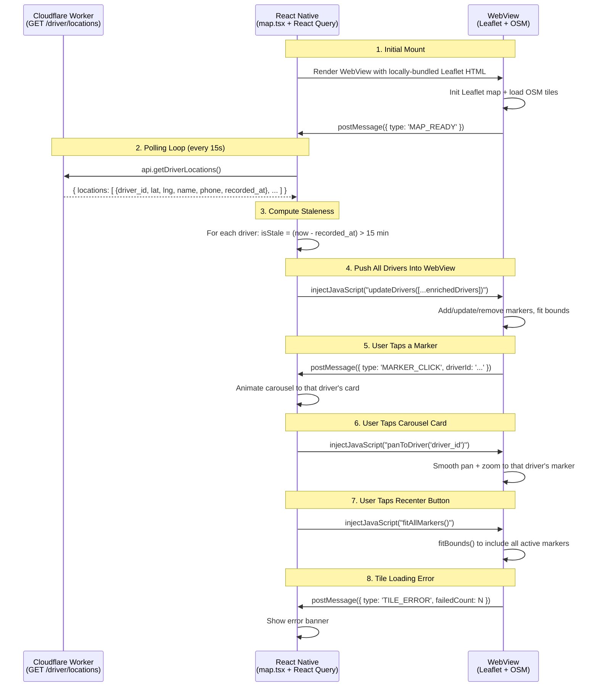

# Implementation Plan: Live Location Tracking with Leaflet + OpenStreetMap

This document is the complete, step-by-step implementation plan to replace `react-native-maps` (Google Maps) with **Leaflet + OpenStreetMap** rendered inside a **React Native WebView** for the Live Driver Tracker screen.

---

## 1. Why Leaflet + OpenStreetMap?

| Concern | Google Maps (`react-native-maps`) | Leaflet + OSM |
|---|---|---|
| API Key required | ✅ Yes — Google Maps Platform billing | ❌ No key, no billing |
| Native build dependency | ✅ Heavy — links Google/Apple Maps SDK | ❌ None — pure JS in a WebView |
| Cross-platform consistency | Varies (Google on Android, Apple on iOS) | Identical on all platforms |
| Customizability | Limited to Google's API surface | Full HTML/CSS/JS control |
| Offline map init | Works (cached tiles) | Works if Leaflet is bundled locally |
| Cost | Free tier, then pay-per-load | Always free |

---

## 2. Services & Dependencies Required

### External Services (zero signup, zero cost)

| Service | Purpose | URL | Limits |
|---|---|---|---|
| **OpenStreetMap Tile Server** | Provides the map tile images (the visual map) | `https://{s}.tile.openstreetmap.org/{z}/{x}/{y}.png` | [Usage policy](https://operations.osmfoundation.org/policies/tiles/): max ~2 req/s, must have valid User-Agent. Fine for a single-user admin app. |

### Already In Place (no changes needed)

| Service | Purpose | Current Usage |
|---|---|---|
| **Cloudflare Worker** | Backend API | `GET /driver/locations` endpoint already exists in `lib/api.ts` line 151 |
| **Cloudflare D1** | Stores `driver_locations` table | Latest lat/lng per driver, written by driver app via `POST /driver/location` |
| **React Query** | Polls locations | `useQuery` with `refetchInterval: 30000` in `map.tsx` line 42 |
| **NetInfo** | Detects offline state | `useNetInfo()` in `map.tsx` line 25 |

### New NPM Package (1 package)

| Package | Purpose | Install Command |
|---|---|---|
| `react-native-webview` | Renders the Leaflet HTML/JS map inside a native WebView container | `npx expo install react-native-webview` |

### Package To Remove After Migration

| Package | Why Remove |
|---|---|
| `react-native-maps` (v1.18.0) | No longer needed — entire map UI is now Leaflet-based in a WebView. Removing it also eliminates the Google Maps SDK native build dependency. |

---

## 3. Architecture & Data Flow

The admin app polls the Cloudflare Worker for all driver locations every 15 seconds. Each poll returns an array of drivers (each driver's location was reported independently by the driver app within the last 10–20 seconds). The React Native layer computes staleness, then pushes the entire array into the WebView, which manages all markers at once.



### Key Design Decisions

1. **Polling interval: 15 seconds** (changed from 30s) — since drivers report their location every 10–20 seconds, polling every 15s ensures we always pick up the latest position within one cycle.
2. **Staleness threshold: 15 minutes** — if a driver hasn't reported in 15+ minutes, their marker turns gray and the carousel shows "Inactive / Stale".
3. **All staleness computed in React Native** — the WebView only receives a pre-computed `isStale: boolean` flag. This keeps the WebView simple and avoids duplicated time logic.
4. **Leaflet assets bundled locally** — NOT loaded from CDN. The HTML template includes the full Leaflet JS (~40KB) and CSS (~15KB) inline. This guarantees the map initializes even on slow/spotty networks.

---

## 4. TypeScript Interfaces

Create a shared types file so all components agree on the data shape.

### File: `components/maps/types.ts` [NEW]

```typescript
/**
 * Raw driver location as returned by GET /driver/locations
 */
export interface RawDriverLocation {
  driver_id: string;
  driver_name: string;
  phone: string;
  latitude: number;
  longitude: number;
  recorded_at: string; // ISO 8601
}

/**
 * Enriched driver location computed in React Native before passing to WebView.
 * The WebView never computes staleness — it just reads the boolean.
 */
export interface EnrichedDriverLocation {
  id: string;           // = driver_id
  name: string;         // = driver_name
  phone: string;
  latitude: number;
  longitude: number;
  isStale: boolean;     // true if (now - recorded_at) > 15 minutes OR invalid date
  lastSeenText: string; // "Updated: 14:30" or "Last seen 23 min ago" or "N/A"
}

/**
 * Messages sent FROM the WebView TO React Native via postMessage.
 * Discriminated union on `type`.
 */
export type WebViewIncomingMessage =
  | { type: 'MAP_READY' }
  | { type: 'MARKER_CLICK'; driverId: string }
  | { type: 'TILE_ERROR'; failedCount: number };

/**
 * Imperative methods exposed by LeafletMap via forwardRef.
 * Called from map.tsx when the user taps carousel cards or recenter button.
 */
export interface LeafletMapRef {
  /** Pan and zoom the map to a specific driver's marker */
  panToDriver: (driverId: string) => void;
  /** Fit bounds to include all currently visible markers */
  fitAllMarkers: () => void;
}

/**
 * Default map center (Jhunjhunu, Rajasthan).
 * Used as the initial view before any driver data loads.
 */
export const DEFAULT_MAP_CENTER = {
  latitude: 27.6094,
  longitude: 75.1398,
  zoom: 12,
} as const;

/**
 * Staleness threshold in minutes.
 * Drivers not reporting for longer than this are shown as gray/stale.
 */
export const STALE_THRESHOLD_MINUTES = 15;
```

---

## 5. Leaflet HTML Template (Bundled Locally)

This is a **raw TypeScript string** containing the complete HTML document. Leaflet's JS and CSS are inlined directly (not loaded from CDN) to guarantee offline initialization.

### File: `components/maps/LeafletHtml.ts` [NEW]

```typescript
/**
 * Complete HTML template for the Leaflet map.
 * 
 * IMPORTANT: In the actual file, the Leaflet CSS and JS must be copied
 * from node_modules or downloaded once and pasted inline between the
 * <style> and <script> tags marked with "INLINE LEAFLET CSS/JS HERE".
 * 
 * For development, we use CDN links. Before production, replace with
 * the inline versions. The CDN version is ~55KB total (gzipped).
 * 
 * Source files:
 *   CSS: https://unpkg.com/leaflet@1.9.4/dist/leaflet.css
 *   JS:  https://unpkg.com/leaflet@1.9.4/dist/leaflet.js
 */
export const leafletHtml = `
<!DOCTYPE html>
<html>
<head>
  <meta name="viewport" content="width=device-width, initial-scale=1.0, maximum-scale=1.0, user-scalable=no" />
  <link rel="stylesheet" href="https://unpkg.com/leaflet@1.9.4/dist/leaflet.css" />
  <script src="https://unpkg.com/leaflet@1.9.4/dist/leaflet.js"><\/script>
  <style>
    * { margin: 0; padding: 0; box-sizing: border-box; }
    body, html, #map {
      height: 100%;
      width: 100%;
      background: #F8FAFC;
      overflow: hidden;
      -webkit-tap-highlight-color: transparent;
    }

    /* ── Active driver marker ── */
    .driver-marker {
      background: #4F46E5;
      border: 2.5px solid white;
      border-radius: 50%;
      box-shadow: 0 2px 8px rgba(79, 70, 229, 0.4);
      transition: transform 0.2s ease;
    }
    .driver-marker:hover {
      transform: scale(1.3);
    }

    /* ── Stale driver marker (offline > 15 min) ── */
    .stale-marker {
      background: #94A3B8;
      border: 2.5px solid white;
      border-radius: 50%;
      box-shadow: 0 2px 8px rgba(0, 0, 0, 0.15);
      opacity: 0.7;
    }

    /* ── Popup styling (shown on marker tap) ── */
    .leaflet-popup-content-wrapper {
      border-radius: 12px !important;
      box-shadow: 0 4px 20px rgba(0, 0, 0, 0.12) !important;
      padding: 0 !important;
    }
    .leaflet-popup-content {
      margin: 0 !important;
      min-width: 160px;
    }
    .leaflet-popup-tip {
      box-shadow: 0 4px 20px rgba(0, 0, 0, 0.12) !important;
    }
    .driver-popup {
      padding: 12px 14px;
    }
    .driver-popup-name {
      font-family: -apple-system, BlinkMacSystemFont, 'Segoe UI', sans-serif;
      font-weight: 700;
      font-size: 13px;
      color: #0F172A;
      margin-bottom: 2px;
    }
    .driver-popup-phone {
      font-family: 'SF Mono', 'Menlo', monospace;
      font-size: 11px;
      color: #94A3B8;
    }
    .driver-popup-time {
      font-family: -apple-system, BlinkMacSystemFont, 'Segoe UI', sans-serif;
      font-size: 10px;
      font-weight: 600;
      color: #64748B;
      margin-top: 6px;
    }

    /* ── Hide Leaflet attribution (we credit in the app UI instead) ── */
    .leaflet-control-attribution {
      font-size: 8px !important;
      opacity: 0.5;
    }
  </style>
</head>
<body>
  <div id="map"></div>
  <script>
    // ═══════════════════════════════════════════════════════
    //  MAP INITIALIZATION
    // ═══════════════════════════════════════════════════════

    var map = L.map('map', {
      zoomControl: false,
      attributionControl: true,
    }).setView([27.6094, 75.1398], 12);

    L.tileLayer('https://{s}.tile.openstreetmap.org/{z}/{x}/{y}.png', {
      maxZoom: 19,
      attribution: '© OSM contributors',
      // Error tracking
      errorTileUrl: '',
    }).addTo(map)
      .on('tileerror', function(e) {
        tileErrorCount++;
        if (tileErrorCount >= 5 && !tileErrorReported) {
          tileErrorReported = true;
          sendMessage({ type: 'TILE_ERROR', failedCount: tileErrorCount });
        }
      });

    var tileErrorCount = 0;
    var tileErrorReported = false;

    // Store all markers keyed by driver ID
    var markers = {};
    // Store all popups keyed by driver ID (for programmatic open)
    var driverData = {};

    // ═══════════════════════════════════════════════════════
    //  HELPER: Send message to React Native
    // ═══════════════════════════════════════════════════════

    function sendMessage(obj) {
      if (window.ReactNativeWebView && window.ReactNativeWebView.postMessage) {
        window.ReactNativeWebView.postMessage(JSON.stringify(obj));
      }
    }

    // Notify RN that the map is ready
    map.whenReady(function() {
      sendMessage({ type: 'MAP_READY' });
    });

    // ═══════════════════════════════════════════════════════
    //  CORE: updateDrivers(drivers)
    //  Called from React Native via injectJavaScript.
    //  Receives the FULL array of enriched drivers every poll.
    //  Handles: add new markers, update existing, remove gone.
    // ═══════════════════════════════════════════════════════

    window.updateDrivers = function(drivers) {
      var incomingIds = [];

      drivers.forEach(function(driver) {
        var id = driver.id;
        incomingIds.push(id);

        // Store data for popup rendering
        driverData[id] = driver;

        var iconClass = driver.isStale ? 'stale-marker' : 'driver-marker';
        var icon = L.divIcon({
          className: iconClass,
          iconSize: [14, 14],
          iconAnchor: [7, 7],  // Center the circle on the coordinate
          popupAnchor: [0, -10],
        });

        var popupHtml =
          '<div class="driver-popup">' +
            '<div class="driver-popup-name">' + escapeHtml(driver.name) + '</div>' +
            '<div class="driver-popup-phone">' + escapeHtml(driver.phone) + '</div>' +
            '<div class="driver-popup-time">' + escapeHtml(driver.lastSeenText) + '</div>' +
          '</div>';

        if (markers[id]) {
          // ── UPDATE existing marker ──
          markers[id].setLatLng([driver.latitude, driver.longitude]);
          markers[id].setIcon(icon);
          markers[id].getPopup().setContent(popupHtml);
        } else {
          // ── ADD new marker ──
          var marker = L.marker([driver.latitude, driver.longitude], { icon: icon })
            .addTo(map)
            .bindPopup(popupHtml, {
              closeButton: false,
              offset: [0, -4],
            })
            .on('click', function() {
              sendMessage({ type: 'MARKER_CLICK', driverId: id });
            });

          markers[id] = marker;
        }
      });

      // ── REMOVE markers for drivers no longer in the response ──
      var existingIds = Object.keys(markers);
      existingIds.forEach(function(id) {
        if (incomingIds.indexOf(id) === -1) {
          map.removeLayer(markers[id]);
          delete markers[id];
          delete driverData[id];
        }
      });
    };

    // ═══════════════════════════════════════════════════════
    //  COMMAND: panToDriver(driverId)
    //  Called when user taps a carousel card in React Native.
    //  Smoothly pans to that driver and opens their popup.
    // ═══════════════════════════════════════════════════════

    window.panToDriver = function(driverId) {
      var marker = markers[driverId];
      if (!marker) return;

      map.flyTo(marker.getLatLng(), 16, { duration: 0.8 });

      // Open popup after pan animation completes
      setTimeout(function() {
        marker.openPopup();
      }, 900);
    };

    // ═══════════════════════════════════════════════════════
    //  COMMAND: fitAllMarkers()
    //  Called when user taps the "recenter" button.
    //  Fits bounds to show all active markers with padding.
    // ═══════════════════════════════════════════════════════

    window.fitAllMarkers = function() {
      var ids = Object.keys(markers);
      if (ids.length === 0) return;

      if (ids.length === 1) {
        map.flyTo(markers[ids[0]].getLatLng(), 15, { duration: 0.8 });
        return;
      }

      var group = L.featureGroup(ids.map(function(id) { return markers[id]; }));
      map.flyToBounds(group.getBounds(), {
        padding: [60, 60],
        maxZoom: 16,
        duration: 0.8,
      });
    };

    // ═══════════════════════════════════════════════════════
    //  UTILITY: Escape HTML to prevent XSS in popup content
    // ═══════════════════════════════════════════════════════

    function escapeHtml(str) {
      if (!str) return '';
      return str
        .replace(/&/g, '&amp;')
        .replace(/</g, '&lt;')
        .replace(/>/g, '&gt;')
        .replace(/"/g, '&quot;');
    }
  <\/script>
</body>
</html>
`;
```

### What each JS function does

| Function | Caller | Purpose |
|---|---|---|
| `updateDrivers(drivers[])` | React Native via `injectJavaScript` | Receives full driver array every poll. Adds/updates/removes markers. Does NOT change map bounds automatically (user controls the view). |
| `panToDriver(driverId)` | React Native via `injectJavaScript` | Smooth pan + zoom when user taps a carousel card. Opens the driver's popup after animation. |
| `fitAllMarkers()` | React Native via `injectJavaScript` | Fits bounds to show all drivers when user taps the recenter button. |
| `sendMessage(obj)` | Internal | Wrapper around `ReactNativeWebView.postMessage()` with safety check. |
| `escapeHtml(str)` | Internal | Prevents XSS injection in popup content from driver names. |

---

## 6. React Native Component: `LeafletMap.tsx`

This component encapsulates the WebView, exposes imperative methods via `forwardRef`, and handles all message parsing.

### File: `components/maps/LeafletMap.tsx` [NEW]

```tsx
import React, { useRef, useEffect, useImperativeHandle, forwardRef, useCallback } from 'react';
import { StyleSheet, View } from 'react-native';
import { WebView, WebViewMessageEvent } from 'react-native-webview';
import { leafletHtml } from './LeafletHtml';
import type {
  EnrichedDriverLocation,
  LeafletMapRef,
  WebViewIncomingMessage,
} from './types';

interface LeafletMapProps {
  /** Array of enriched driver locations (staleness pre-computed) */
  locations: EnrichedDriverLocation[];
  /** Called when user taps a marker dot on the map */
  onMarkerClick?: (driverId: string) => void;
  /** Called when the Leaflet map finishes initializing */
  onMapReady?: () => void;
  /** Called when OSM tile loading fails repeatedly */
  onTileError?: (failedCount: number) => void;
}

export const LeafletMap = forwardRef<LeafletMapRef, LeafletMapProps>(
  ({ locations, onMarkerClick, onMapReady, onTileError }, ref) => {
    const webViewRef = useRef<WebView>(null);
    const isMapReady = useRef(false);
    // Queue: if locations arrive before MAP_READY, store them and flush after ready
    const pendingLocations = useRef<EnrichedDriverLocation[] | null>(null);

    // ── Inject JS helper ──
    const injectJS = useCallback((js: string) => {
      if (webViewRef.current && isMapReady.current) {
        webViewRef.current.injectJavaScript(`${js}; true;`);
      }
    }, []);

    // ── Push locations into WebView whenever they change ──
    useEffect(() => {
      if (!isMapReady.current) {
        // Map not ready yet — store for later
        pendingLocations.current = locations;
        return;
      }
      const json = JSON.stringify(locations);
      injectJS(`window.updateDrivers(${json})`);
    }, [locations, injectJS]);

    // ── Expose imperative methods to parent (map.tsx) ──
    useImperativeHandle(ref, () => ({
      panToDriver(driverId: string) {
        injectJS(`window.panToDriver(${JSON.stringify(driverId)})`);
      },
      fitAllMarkers() {
        injectJS(`window.fitAllMarkers()`);
      },
    }), [injectJS]);

    // ── Handle messages FROM the WebView ──
    const handleMessage = useCallback((event: WebViewMessageEvent) => {
      try {
        const data: WebViewIncomingMessage = JSON.parse(event.nativeEvent.data);

        switch (data.type) {
          case 'MAP_READY':
            isMapReady.current = true;
            onMapReady?.();
            // Flush any locations that arrived before the map was ready
            if (pendingLocations.current) {
              const json = JSON.stringify(pendingLocations.current);
              webViewRef.current?.injectJavaScript(
                `window.updateDrivers(${json}); true;`
              );
              pendingLocations.current = null;
            }
            break;

          case 'MARKER_CLICK':
            onMarkerClick?.(data.driverId);
            break;

          case 'TILE_ERROR':
            onTileError?.(data.failedCount);
            break;
        }
      } catch (e) {
        console.warn('[LeafletMap] Failed to parse WebView message:', e);
      }
    }, [onMarkerClick, onMapReady, onTileError]);

    return (
      <View style={styles.container}>
        <WebView
          ref={webViewRef}
          originWhitelist={['*']}
          source={{ html: leafletHtml }}
          style={styles.map}
          onMessage={handleMessage}
          scrollEnabled={false}
          bounces={false}
          overScrollMode="never"
          domStorageEnabled
          javaScriptEnabled
          // Prevent WebView from navigating away on link taps
          onShouldStartLoadWithRequest={() => true}
          // Performance: only render when visible
          androidLayerType="hardware"
        />
      </View>
    );
  }
);

LeafletMap.displayName = 'LeafletMap';

const styles = StyleSheet.create({
  container: {
    flex: 1,
  },
  map: {
    flex: 1,
    backgroundColor: '#F8FAFC',
  },
});
```

### Why `forwardRef` + `useImperativeHandle`?

The parent screen (`map.tsx`) needs to tell the map to do things:
- **Carousel card tap** → call `ref.current.panToDriver(driverId)` → smooth pan
- **Recenter button tap** → call `ref.current.fitAllMarkers()` → fit all markers

Without imperative methods, the parent would have to pass `commandQueue` state arrays, which is fragile. `useImperativeHandle` gives a clean, type-safe API.

### Race Condition Handling

The WebView takes ~200-500ms to load and initialize Leaflet. During this time, React Query may already have fetched driver locations. Without protection, the first `injectJavaScript` call would silently fail (no `window.updateDrivers` function yet).

**Solution**: The `isMapReady` ref starts as `false`. Locations that arrive before `MAP_READY` are stored in `pendingLocations`. When `MAP_READY` fires, the pending locations are flushed immediately.

---

## 7. Updated Map Screen: `map.tsx`

This is the **complete replacement** for `app/(tabs)/delivery/map.tsx`. It preserves every existing UI element (floating header, refresh button, recenter button, bottom carousel, offline state, loading state, error banner) and swaps only the map renderer.

### File: `app/(tabs)/delivery/map.tsx` [MODIFY — full replacement]

```tsx
import React, { useMemo, useRef, useState, useEffect, useCallback } from 'react';
import {
  Text,
  View,
  ActivityIndicator,
  TouchableOpacity,
  ScrollView,
} from 'react-native';
import { useQuery } from '@tanstack/react-query';
import { useNavigation } from 'expo-router';
import { SymbolView } from 'expo-symbols';
import { useSafeAreaInsets } from 'react-native-safe-area-context';
import { useNetInfo } from '@react-native-community/netinfo';

import { api } from '../../../lib/api';
import { LeafletMap } from '../../../components/maps/LeafletMap';
import type {
  RawDriverLocation,
  EnrichedDriverLocation,
  LeafletMapRef,
  STALE_THRESHOLD_MINUTES,
} from '../../../components/maps/types';

export default function LiveMapScreen() {
  const navigation = useNavigation();
  const [isFocused, setIsFocused] = useState(true);
  const insets = useSafeAreaInsets();
  const mapRef = useRef<LeafletMapRef>(null);
  const netInfo = useNetInfo();
  const isOffline = netInfo.isConnected === false;
  const [tileError, setTileError] = useState(false);

  // ── Focus/blur tracking (pause polling when not visible) ──
  useEffect(() => {
    const unsubscribeFocus = navigation.addListener('focus', () => {
      setIsFocused(true);
    });
    const unsubscribeBlur = navigation.addListener('blur', () => {
      setIsFocused(false);
    });
    return () => {
      unsubscribeFocus();
      unsubscribeBlur();
    };
  }, [navigation]);

  // ── Poll driver locations every 15 seconds ──
  const { data, isLoading, error, refetch } = useQuery({
    queryKey: ['driver-locations'],
    queryFn: () => api.getDriverLocations(),
    refetchInterval: 15000, // 15s to match driver reporting cadence
    enabled: isFocused && !isOffline,
  });

  // ── Enrich raw locations with staleness (computed ONCE in RN) ──
  const enrichedLocations: EnrichedDriverLocation[] = useMemo(() => {
    const raw: RawDriverLocation[] = data?.locations || [];
    const now = new Date();

    return raw.map((loc) => {
      const recordedAt = loc.recorded_at ? new Date(loc.recorded_at) : null;
      const isValidDate = recordedAt !== null && !isNaN(recordedAt.getTime());
      const diffMs = isValidDate ? now.getTime() - recordedAt!.getTime() : Infinity;
      const diffMins = Math.floor(diffMs / 60000);
      const isStale = !isValidDate || diffMins > 15;

      let lastSeenText: string;
      if (!isValidDate) {
        lastSeenText = 'N/A';
      } else if (isStale) {
        lastSeenText = `Last seen ${diffMins} min ago`;
      } else {
        lastSeenText = `Updated: ${recordedAt!.toLocaleTimeString('en-IN', {
          hour: '2-digit',
          minute: '2-digit',
        })}`;
      }

      return {
        id: loc.driver_id,
        name: loc.driver_name,
        phone: loc.phone,
        latitude: loc.latitude,
        longitude: loc.longitude,
        isStale,
        lastSeenText,
      };
    });
  }, [data]);

  // ── Handlers ──

  const handleRecenter = useCallback(() => {
    mapRef.current?.fitAllMarkers();
  }, []);

  const handleCarouselCardPress = useCallback((driverId: string) => {
    mapRef.current?.panToDriver(driverId);
  }, []);

  const handleMarkerClick = useCallback((driverId: string) => {
    // Future: could scroll carousel to this driver's card
    // For now, the popup opens inside the WebView
  }, []);

  const handleTileError = useCallback((failedCount: number) => {
    setTileError(true);
  }, []);

  // ── Offline state ──
  if (isOffline) {
    return (
      <View className="flex-1 justify-center items-center bg-slate-50 dark:bg-slate-900 px-6">
        <SymbolView
          name={{ ios: 'wifi.slash', android: 'wifi_off', web: 'wifi_off' }}
          tintColor="#EF4444"
          size={48}
        />
        <Text className="text-base font-bold text-slate-800 dark:text-slate-100 mt-4 text-center">
          Location data unavailable offline
        </Text>
        <Text className="text-xs text-slate-400 dark:text-slate-500 mt-1 text-center max-w-[240px]">
          Please reconnect to the internet to track driver locations in real time.
        </Text>
      </View>
    );
  }

  // ── Loading state ──
  if (isLoading) {
    return (
      <View className="flex-1 justify-center items-center bg-slate-50 dark:bg-slate-900">
        <ActivityIndicator size="large" color="#4F46E5" />
        <Text className="text-sm font-semibold text-slate-500 dark:text-slate-400 mt-4">
          Loading live tracker map...
        </Text>
      </View>
    );
  }

  // ── Main render ──
  return (
    <View className="flex-1 relative">
      {/* ════════════ Floating Header Panel ════════════ */}
      <View
        style={{ paddingTop: 10 }}
        className="absolute top-0 left-4 right-4 z-10"
      >
        <View className="bg-white/95 dark:bg-slate-800/95 border border-slate-100 dark:border-slate-800/60 p-4 rounded-2xl shadow-lg flex-row justify-between items-center backdrop-blur-md">
          <View className="flex-1 pr-3">
            <Text className="text-base font-bold text-slate-900 dark:text-slate-50">
              Live Tracker
            </Text>
            <Text className="text-[10px] text-slate-400 dark:text-slate-500 font-semibold mt-0.5">
              {enrichedLocations.length} active drivers • updates every 15s
            </Text>
          </View>

          <View className="flex-row">
            {/* Refresh Button */}
            <TouchableOpacity
              onPress={() => refetch()}
              className="p-2.5 bg-slate-50 dark:bg-slate-900 border border-slate-200 dark:border-slate-750 rounded-xl mr-2 active:scale-95"
            >
              <SymbolView
                name={{ ios: 'arrow.clockwise', android: 'refresh', web: 'refresh' }}
                tintColor="#4F46E5"
                size={16}
              />
            </TouchableOpacity>

            {/* Recenter Button */}
            <TouchableOpacity
              onPress={handleRecenter}
              disabled={enrichedLocations.length === 0}
              className={`p-2.5 border rounded-xl active:scale-95 ${
                enrichedLocations.length === 0
                  ? 'bg-slate-100 border-slate-200 opacity-50'
                  : 'bg-slate-50 dark:bg-slate-900 border-slate-200 dark:border-slate-750'
              }`}
            >
              <SymbolView
                name={{ ios: 'scope', android: 'my_location', web: 'my_location' }}
                tintColor={enrichedLocations.length === 0 ? '#94A3B8' : '#4F46E5'}
                size={16}
              />
            </TouchableOpacity>
          </View>
        </View>

        {/* Error banner: API poll failure */}
        {error && (
          <View className="mt-2 bg-rose-50 dark:bg-rose-950/20 border border-rose-100 dark:border-rose-900/40 p-2.5 rounded-xl flex-row items-center">
            <SymbolView
              name={{ ios: 'exclamationmark.triangle.fill', android: 'warning', web: 'warning' }}
              tintColor="#EF4444"
              size={12}
            />
            <Text className="text-[10px] text-rose-600 dark:text-rose-450 font-semibold ml-2 flex-1">
              Offline or failed to poll latest coordinates.
            </Text>
          </View>
        )}

        {/* Error banner: OSM tile loading failure */}
        {tileError && !error && (
          <View className="mt-2 bg-amber-50 dark:bg-amber-950/20 border border-amber-100 dark:border-amber-900/40 p-2.5 rounded-xl flex-row items-center">
            <SymbolView
              name={{ ios: 'exclamationmark.triangle.fill', android: 'warning', web: 'warning' }}
              tintColor="#F59E0B"
              size={12}
            />
            <Text className="text-[10px] text-amber-600 dark:text-amber-450 font-semibold ml-2 flex-1">
              Map tiles failed to load. The map may appear incomplete.
            </Text>
          </View>
        )}
      </View>

      {/* ════════════ Leaflet Map (replaces <MapView>) ════════════ */}
      <LeafletMap
        ref={mapRef}
        locations={enrichedLocations}
        onMarkerClick={handleMarkerClick}
        onTileError={handleTileError}
      />

      {/* ════════════ Bottom Driver Carousel ════════════ */}
      {enrichedLocations.length > 0 ? (
        <View
          style={{ bottom: insets.bottom + 20 }}
          className="absolute left-4 right-4 z-10"
        >
          <ScrollView
            horizontal
            showsHorizontalScrollIndicator={false}
            contentContainerStyle={{ paddingHorizontal: 2 }}
            className="flex-row"
          >
            {enrichedLocations.map((driver) => (
              <TouchableOpacity
                key={driver.id}
                onPress={() => handleCarouselCardPress(driver.id)}
                className="bg-white/95 dark:bg-slate-800/95 border border-slate-100 dark:border-slate-800/60 py-3.5 px-4 rounded-2xl mr-3 shadow-md min-w-[150px] flex-row items-center active:scale-95"
              >
                <View
                  className={`h-2.5 w-2.5 rounded-full mr-2.5 ${
                    driver.isStale ? 'bg-slate-350 dark:bg-slate-500' : 'bg-emerald-500'
                  }`}
                />
                <View>
                  <Text className="text-xs font-bold text-slate-800 dark:text-slate-100">
                    {driver.name}
                  </Text>
                  <Text className="text-[9px] text-slate-400 dark:text-slate-500 font-semibold mt-0.5">
                    {driver.isStale ? 'Inactive / Stale' : 'Active tracking'}
                  </Text>
                </View>
              </TouchableOpacity>
            ))}
          </ScrollView>
        </View>
      ) : (
        <View
          style={{ bottom: insets.bottom + 20 }}
          className="absolute left-4 right-4 z-10 bg-white/95 dark:bg-slate-800/95 border border-slate-100 dark:border-slate-800/60 p-4 rounded-2xl shadow-md items-center justify-center backdrop-blur-md"
        >
          <Text className="text-xs font-semibold text-slate-500 dark:text-slate-400">
            No drivers are currently active.
          </Text>
        </View>
      )}
    </View>
  );
}
```

### What changed from the current `map.tsx`

| Area | Before (react-native-maps) | After (Leaflet) |
|---|---|---|
| Map component | `<MapView>` + `<Marker>` + `<Callout>` | `<LeafletMap ref={mapRef}>` |
| Map ref type | `MapView` | `LeafletMapRef` |
| Marker rendering | JSX `<Marker>` components | `injectJavaScript('updateDrivers(...)')` |
| Callout/popup | `<Callout tooltip>` with RN Views | HTML popup inside WebView |
| Recenter | `mapRef.current.fitToCoordinates(...)` | `mapRef.current.fitAllMarkers()` |
| Carousel card tap | `mapRef.current.animateToRegion(...)` | `mapRef.current.panToDriver(id)` |
| Poll interval | 30 seconds | **15 seconds** (matches driver cadence) |
| Staleness computation | Inline in `renderedMarkers` memo AND carousel | Once in `enrichedLocations` memo, shared by both |
| Tile error handling | None | `tileError` state + amber warning banner |
| Provider config | `PROVIDER_GOOGLE` on Android | N/A (OSM tiles, no provider needed) |

---

## 8. Implementation Steps (Ordered)

### Step 1: Install `react-native-webview`

```bash
cd /home/anas/Development/Projects/wholesale-mobile-app/admin-app
npx expo install react-native-webview
```

### Step 2: Create the new component files

Create the folder and 3 files:

```
components/
  maps/                      ← NEW folder
    types.ts                 ← NEW — shared TypeScript interfaces & constants
    LeafletHtml.ts           ← NEW — raw HTML template string
    LeafletMap.tsx            ← NEW — React component wrapping WebView
```

Copy the code from Sections 4, 5, and 6 above into these files exactly.

### Step 3: Replace `map.tsx`

Overwrite `app/(tabs)/delivery/map.tsx` with the code from Section 7 above. This:
- Removes ALL imports from `react-native-maps`
- Removes the `Platform` import (no longer needed for `PROVIDER_GOOGLE`)
- Removes the `formatCurrency` import (was unused)
- Adds imports for `LeafletMap`, types, and constants
- Replaces `<MapView>` with `<LeafletMap>`
- Changes poll interval from 30s to 15s
- Centralizes staleness computation

### Step 4: Remove `react-native-maps` from the project

```bash
cd /home/anas/Development/Projects/wholesale-mobile-app/admin-app

# Remove the package
pnpm remove react-native-maps

# Rebuild the native Android project (removes Google Maps SDK linkage)
npx expo prebuild --clean
```

> **Why `--clean`?** `react-native-maps` adds native code to `android/app/build.gradle` and `AndroidManifest.xml` (Google Maps API key entry, SDK dependency). A clean prebuild regenerates the `android/` folder from scratch, ensuring no stale native references remain.

### Step 5: Verify the build compiles

```bash
npx tsc --noEmit
```

This checks for TypeScript errors across the entire project. Specifically watch for:
- Any remaining imports of `react-native-maps` in other files
- Any type mismatches in the new component interfaces

### Step 6: Test on device

```bash
npx expo run:android
```

---

## 9. Multi-Driver Scenario: How It Works

The admin sees **all drivers simultaneously** on one map. Each driver's location was reported independently by their driver app within the last 10–20 seconds. Here's the exact flow:

### Timeline Example (3 drivers)

```
Time    Event
────    ─────
0:00    Admin opens Live Tracker → map loads, first poll fires
0:01    API returns: [Driver A (lat=27.61, lng=75.14, recorded_at=23:59:50),
                      Driver B (lat=27.58, lng=75.11, recorded_at=23:59:55),
                      Driver C (lat=27.63, lng=75.17, recorded_at=23:59:42)]
0:01    RN computes: A=active, B=active, C=active
0:01    RN injects: updateDrivers([A, B, C]) → 3 markers appear on map
0:15    Second poll fires
0:15    API returns: [A (new position), B (new position), C (same position)]
0:15    RN injects: updateDrivers([A', B', C]) → markers A,B slide to new spots
0:30    Third poll fires
0:30    API returns: [A (new), B (new)] ← Driver C stopped reporting
0:30    RN injects: updateDrivers([A'', B'']) → marker C is REMOVED from map
...
5:00    Driver C comes back online
5:00    API returns: [A, B, C] → marker C reappears
```

### What "not simultaneously, but one after the other within 10–20 seconds" means

Each **driver app** sends `POST /driver/location` independently — e.g., Driver A at `T+0s`, Driver B at `T+12s`, Driver C at `T+18s`. The Cloudflare Worker stores only the **latest** location per driver. When the admin app polls `GET /driver/locations`, it gets **all** latest positions in a single response array. The admin sees all markers at once — the 10–20s stagger is invisible to them.

This is why polling every **15 seconds** is the right interval:
- If Driver A reported at T+0 and we poll at T+15, we'll see A's location (15s old — acceptable).
- If we polled every 30s, we'd see A's location at 30s old, which feels laggy.
- Polling faster than 10s wastes bandwidth since drivers haven't reported new data yet.

---

## 10. Performance Considerations

| Concern | Mitigation |
|---|---|
| **WebView memory** | WebView is a heavy component (~20-40MB). It is only mounted when the map screen is visible. The `isFocused` state pauses polling when the user navigates away, but the WebView stays mounted to avoid re-initialization lag when coming back. |
| **Marker count (50+ drivers)** | For this business (wholesale delivery), the expected driver count is <20. If it grows beyond 50, add `Leaflet.markercluster` plugin (a single extra JS file inlined into the HTML). |
| **Tile caching** | Android's WebView respects HTTP cache headers. OSM tiles have `Cache-Control: max-age=604800` (7 days). Once loaded, tiles are served from disk cache without network calls. |
| **`injectJavaScript` frequency** | Called once every 15 seconds with the full driver array. This is negligible — the WebView processes it in <5ms. |
| **JSON serialization** | For 20 drivers, the JSON payload is ~2KB. No optimization needed. |

---

## 11. Security Notes

| Flag / Setting | Why It's Set | Risk |
|---|---|---|
| `originWhitelist={['*']}` | Required for `source={{ html: ... }}` (local HTML string has no origin). Safe because we control the HTML content entirely. | None — no external content loaded except OSM tiles. |
| `javaScriptEnabled` | Leaflet is a JS library — it cannot function without JS. | The HTML is hardcoded; no user-supplied scripts. |
| `domStorageEnabled` | Some Leaflet plugins use `localStorage`. Not strictly required for our use case but causes no harm. | None. |
| `escapeHtml()` in popup | Driver names come from the database. We escape them before inserting into popup HTML to prevent injection. | Mitigated. |

---

## 12. Rollback Plan

If the Leaflet/WebView approach has unforeseen issues (e.g., WebView rendering bugs on specific Android OEMs, tile loading failures in certain regions):

1. **Revert the commit** — since this is a single-component swap, reverting restores the old `react-native-maps` implementation.
2. **Re-add the dependency**: `pnpm add react-native-maps@1.18.0`
3. **Rebuild native project**: `npx expo prebuild --clean`
4. The `components/maps/` folder can be left in place (unused) or deleted.

**Time to rollback: < 5 minutes.**

---

## 13. Verification Plan

### Automated Verification

```bash
# 1. TypeScript compilation (no type errors)
npx tsc --noEmit

# 2. Ensure react-native-maps is fully removed
grep -r "react-native-maps" --include="*.tsx" --include="*.ts" app/ components/ lib/
# Expected output: no matches

# 3. Ensure new components exist
ls -la components/maps/
# Expected: types.ts, LeafletHtml.ts, LeafletMap.tsx
```

### Manual Verification (on device/emulator)

| # | Test | Expected Result |
|---|---|---|
| 1 | Open Delivery → Live Tracker | Map loads with OSM tiles. No blank screen. |
| 2 | Wait for first poll (15s) | Driver markers appear as indigo dots at their coordinates. |
| 3 | Tap a marker dot | Popup appears showing driver name, phone, and last-seen time. |
| 4 | Tap a carousel card at the bottom | Map smoothly pans and zooms to that driver's marker. Popup opens. |
| 5 | Tap the recenter button (⊙) | Map zooms out to fit all driver markers with padding. |
| 6 | Tap the refresh button (↻) | Poll fires immediately. Markers update if positions changed. |
| 7 | Wait 15 seconds | Markers auto-update without user interaction. |
| 8 | Turn airplane mode ON | Offline screen appears ("Location data unavailable offline"). |
| 9 | Turn airplane mode OFF | Map reappears. Polling resumes. |
| 10 | Driver goes offline (>15 min) | Their marker turns gray. Carousel shows "Inactive / Stale". |
| 11 | All drivers go offline | Carousel replaced with "No drivers are currently active" card. |
| 12 | Simulate tile failure (offline after map loads) | Amber warning banner: "Map tiles failed to load". |

---

## 14. Files Changed Summary

| File | Action | Description |
|---|---|---|
| `components/maps/types.ts` | **NEW** | Shared TypeScript interfaces, constants |
| `components/maps/LeafletHtml.ts` | **NEW** | HTML/CSS/JS template string for Leaflet map |
| `components/maps/LeafletMap.tsx` | **NEW** | React component wrapping WebView with forwardRef |
| `app/(tabs)/delivery/map.tsx` | **MODIFY** | Full replacement — swap MapView → LeafletMap |
| `package.json` | **MODIFY** | Remove `react-native-maps`, add `react-native-webview` |
